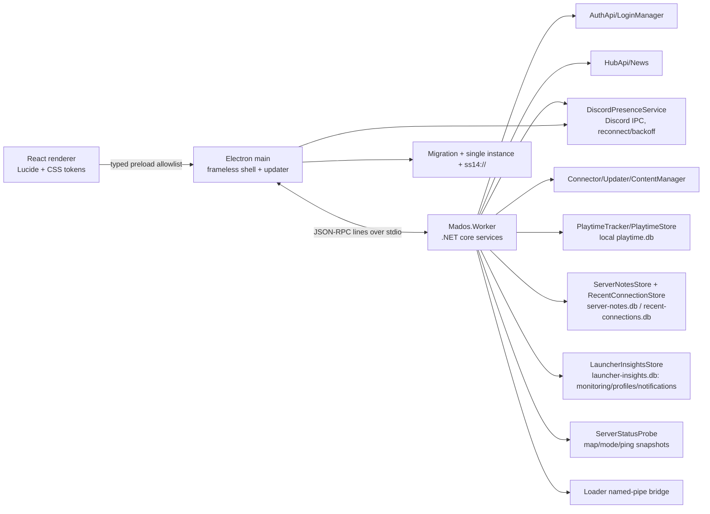

# Mados Launcher: инвентаризация поведения

| Функция | Реальный источник/сервис | Worker/IPC | Loading и ошибка | Успешный результат | Экран | Ручная проверка |
|---|---|---|---|---|---|---|
| Авторизация и 2FA | `AuthApi`, `LoginManager`, SQLite `Login` | `auth.login` | busy форма, код `TFA_REQUIRED`, сетевые ошибки | токен хранится только в C# и приходит DTO аккаунта | onboarding | войти с паролем и 2FA |
| Несколько аккаунтов | `DataManager`, `LoginManager` | `auth.getAccounts`, `auth.switchAccount`, `auth.logout` | expired/unsure отображаются отдельно | выбранный аккаунт и `SelectedLogin` сохранены | account popover | добавить второй аккаунт, переключить, выйти |
| Сервера и описание | `HubApi`, `ServerListCache`, `ServerPingProbe`, `ServerStatusProbe`, реальные hub URLs | `servers.list`, `servers.refresh`, `servers.info` | skeleton, partial hub error, offline banner, detail retry | карточки с online/players/tags, отдельный ping каждого сервера и modal с описанием, картой, режимом, online и ping | Servers/Home/Favorites | открыть карточку из каталога, избранного и последнего сервера |
| Поиск, сортировка, фильтры | hub `StatusData.Tags` + сохранённые UI-фильтры | `servers.list` | debounce 180 мс, empty state | карточки фильтруются локально и настройки сохраняются | Servers | поиск, chips, «только с игроками», перезапуск |
| Избранное | `DataManager.FavoriteServers` | `favorites.list/add/remove` | duplicate/not-found структурированная ошибка | SQLite favourite обновлён | Home/Servers | добавить, удалить, перезапустить |
| Заметки сервера | локальный `server-notes.db`, `ServerNotesStore`, ключ аккаунт+адрес | `serverNotes.list/upsert/remove` | 4000 символов, пустой текст очищает запись, ошибки видны в modal | заметка сохраняется только для активного аккаунта и показывается в описании сервера | Server details | создать, изменить, удалить заметку, переключить аккаунт |
| Недавние подключения | локальный `recent-connections.db`, `RecentConnectionStore` | `recentConnections.list` | пустое состояние, account-scoped список, неизвестные ping/online сохраняются как `—` | успешный `ClientRunning` записывается с последним реальным ping/online и доступен для повторного запуска | Home | подключиться, вернуться в лаунчер, повторить запуск, сменить аккаунт |
| Мониторинг избранного | локальный `launcher-insights.db`, `LauncherInsightsStore`, `ServerStatusProbe` | `monitoring.getFavorites`, `monitoring.refresh`, `monitoring.updated` | ручное обновление, offline/нет данных, samples старше 30 дней удаляются | отдельный ping/online/player delta и локальная sparkline-история по активному аккаунту; отсутствующий в hub favorite проверяется напрямую | Servers | добавить favorite, обновить каталог, проверить online/offline, ping delta и смену аккаунта |
| Профили запуска | локальный `launcher-insights.db`, `LauncherInsightsStore` | `launchProfiles.list/create/update/remove/use`, `launchProfiles.updated` | account-scoped CRUD, один профиль на очищенный адрес | профиль запускает обычный `servers.connect`, LastUsedAt обновляется | Home/Servers/Command Palette | создать, изменить, запустить, удалить, переключить аккаунт |
| Журнал уведомлений | локальный `launcher-insights.db`, `LauncherInsightsStore` | `notifications.list/markRead/clear`, `notification.created` | максимум 100 записей и 30 дней, toast не блокирует работу | offline→online избранного и завершение игрового обновления сохраняются локально | title bar/toast | дождаться возвращения сервера, отметить прочитанным, очистить текущий аккаунт |
| Прямое подключение | `Connector` | `servers.connect` | проверка `ss14://`/`ss14s://`, `CONNECTION_BUSY` | реальный update/launch flow | Servers | вставить URI и подключиться |
| Privacy policy | `Connector.HandlePrivacyPolicyAsync` | `connection.progress`, `connection.confirmPrivacyPolicy` | ожидание/отмена | принятие записано в SQLite | connection banner | сервер с новой policy |
| Engine/content update | `Updater`, `ContentManager`, `EngineManagerDynamic` | `servers.connect`, `updates.start`, progress events | update error/cancel | реальные игровые файлы и loader запуск | connection banner | подключение к серверу с отсутствующим build |
| ZIP content/replay | `Connector.LaunchContentBundlePathAsync` | `content.openBundle` | invalid ZIP/`NotAContentBundle` | реальный bundle launch | Home/drag overlay | выбрать и бросить `.zip` |
| Время игры | `PlaytimeTracker`, `PlaytimeStore`, локальный `playtime.db` | `playtime.getSummary`, `playtime.clear`, `playtime.updated` | skeleton, структурированная ошибка, подтверждение удаления | учёт `ClientRunning`–`ClientExited`, heartbeat 15 с, восстановление после перезапуска, периоды all/today/7d | Время игры | войти, запустить обычный сервер, проверить live-счётчик, закрыть клиент, сменить аккаунт и очистить историю |
| Новости | `CodeHollow.FeedReader` + GitHub Releases API `ConfigConstants.MadosLauncherGitHubRepository` | `news.list` | skeleton, retry, частичная ошибка одного источника | cards с источником, датой, кратким описанием и safe external link | News | открыть официальную статью и GitHub release, повторить после offline |
| Настройки | C# CVars и `LocalizationManager` | `settings.get/update` | saving indicator | compat, assets, language, verbose logging сохранены | Settings | изменить каждый toggle и перезапустить |
| Discord Rich Presence | локальные CVars + `DiscordPresenceService` и Discord IPC | `presence.updated`, `settings.changed` | Discord отсутствует — статус `unavailable`, worker и UI продолжают работу | меню/подключение/игра с сервером, картой, режимом, online, ping и опциональным ником; токены очищаются worker-границей | Settings/Discord + Discord client | закрыть Discord, подключиться к серверу, дождаться ClientRunning, проверить возврат к меню и настройку ника |
| Deep links | Electron single-instance + `WorkerHost` | `app.openDeepLink`, `deepLink.received` | invalid/unsupported URI | первый процесс получает URI, второй закрывается | connection banner | запуск `Mados Launcher.exe ss14://...` дважды |
| Loader commands | `WorkerCommandBridge`, старое имя pipe | pipe `SS14.Launcher.CommandPipe*` | malformed hex логируется без секрета | `c/C` команда стартует Connect | connection banner | отправить legacy `c` и encoded `C` |
| Shell update | `electron-updater` | `shell.update*` renderer events | error banner, no auto-download | download + restart after verified update | global banner | packaged build с release feed |
| Compatibility update | `LauncherInfoManager` | `updates.getStatus` | out-of-date banner | download link/status | compatibility banner | запретить/восстановить network |
| Migration | `Mados.Worker.DataMigration`, Electron marker | startup before worker | backup/error leaves old data | new settings DB + old cache resolver | startup logs | запуск поверх old directory |
| Диагностика | `LauncherDiagnostics`, Serilog | stderr/file logs | worker start error without secrets | architecture/CPU/SQLite diagnostics | Settings/launcher log | проверить shutdown и restart |

## Overlay-state контрольная точка

`busy` покрыт loading/saving/connection banners; `connecting`, `out-of-date`, early access, Intel degradation, Rosetta и auth override приходят в `app.ready.compatibility`; drag-and-drop имеет отдельный overlay; login errors/TFA находятся в onboarding; expired account переводит в повторный login. Offline/partial hub/error/retry состояния не скрываются пустыми `catch`.

## Архитектура

